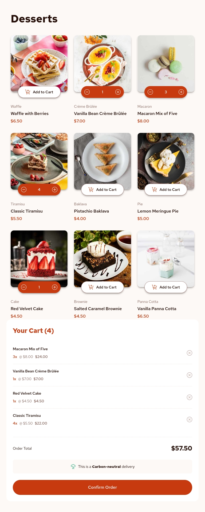
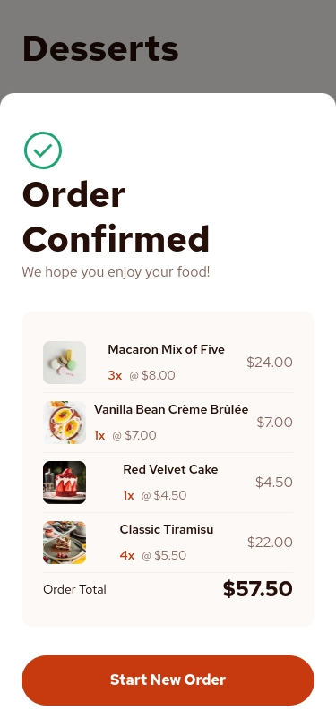
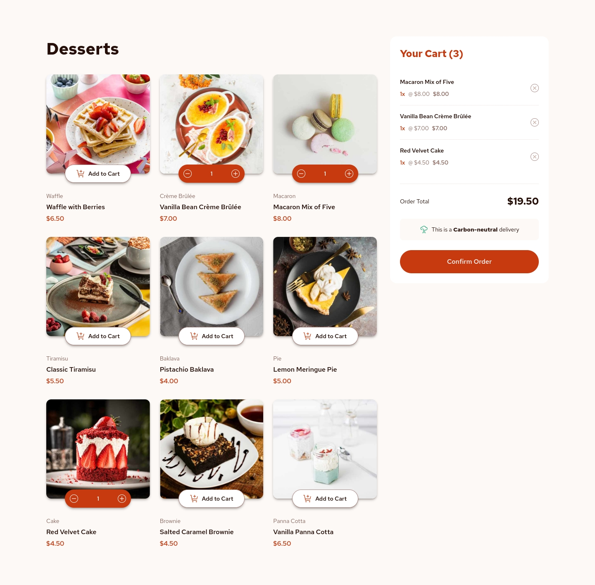
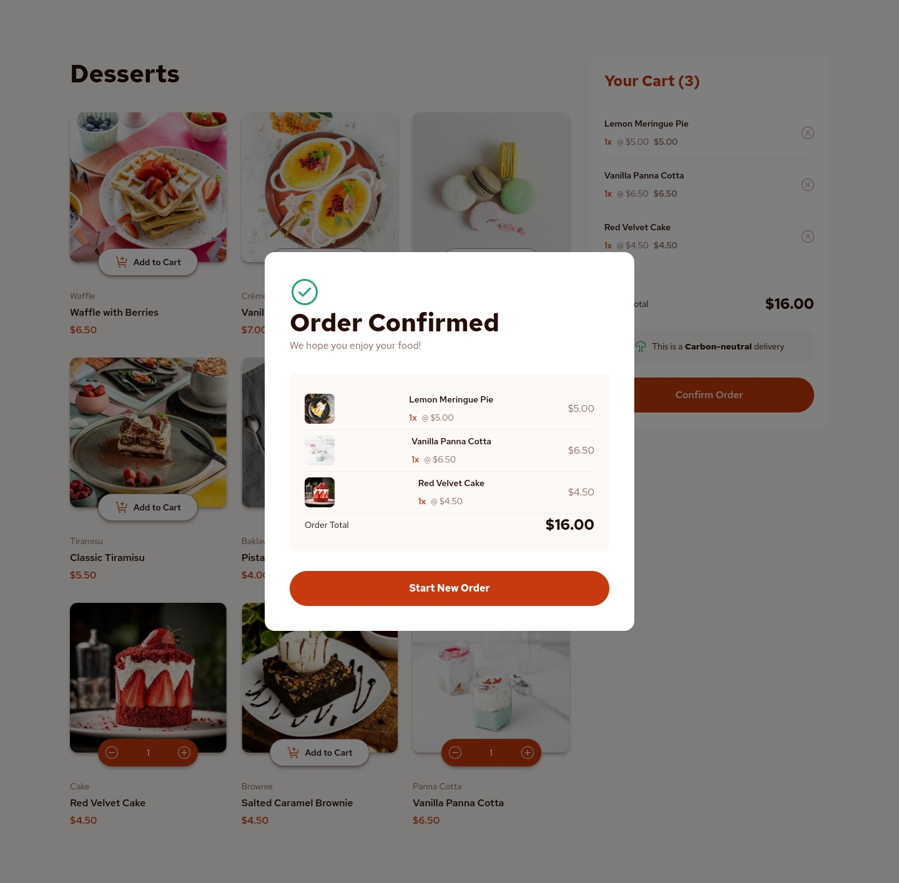
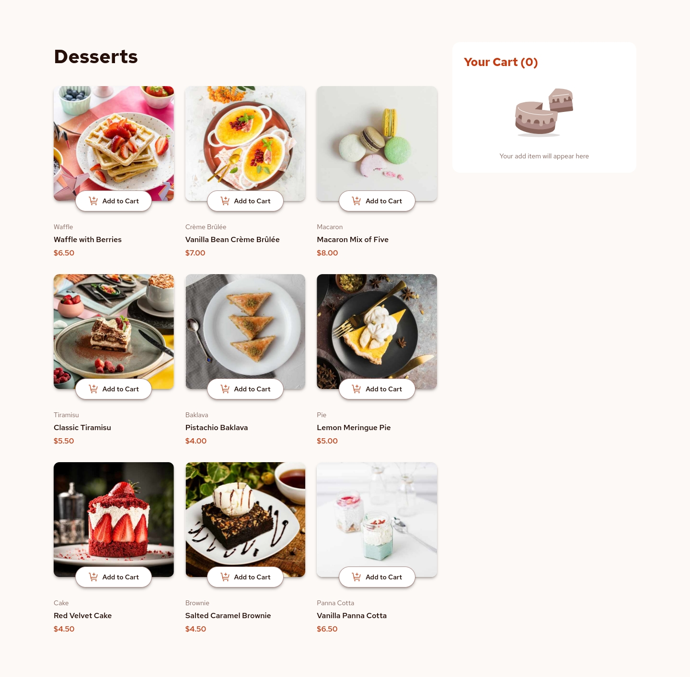
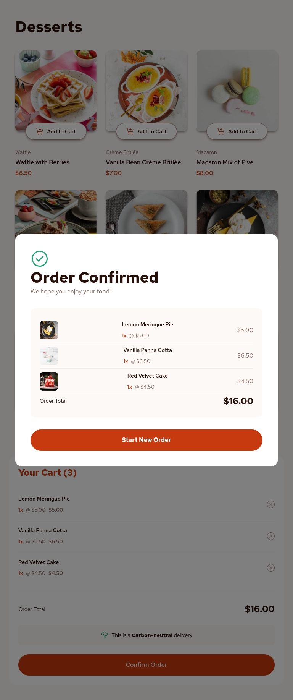

# Frontend Mentor - Product list with cart solution

This is a solution to the [Product list with cart challenge on Frontend Mentor](https://www.frontendmentor.io/challenges/product-list-with-cart-5MmqLVAp_d). Frontend Mentor challenges help you improve your coding skills by building realistic projects. 

## Table of contents

- [Overview](#overview)
  - [The challenge](#the-challenge)
  - [Screenshot](#screenshot)
  - [Links](#links)
- [My process](#my-process)
  - [Built with](#built-with)
  - [What I learned](#what-i-learned)
  - [Useful resources](#useful-resources)
- [Author](#author)

## Overview

### The challenge

Users should be able to:

- Add items to the cart and remove them
- Increase/decrease the number of items in the cart
- See an order confirmation modal when they click "Confirm Order"
- Reset their selections when they click "Start New Order"
- View the optimal layout for the interface depending on their device's screen size
- See hover and focus states for all interactive elements on the page

### Screenshot








### Links

- Solution URL: [Add solution URL here](https://your-solution-url.com)
- Live Site URL: [Add live site URL here](https://your-live-site-url.com)

## My process

### Built with

- Semantic HTML5 markup
- CSS custom properties
- Flexbox
- CSS Grid
- Mobile-first workflow
- [React](https://reactjs.org/) - JS library
- [Vite](https://vitejs.dev/) - Build tool
- [Tailwind CSS](https://tailwindcss.com/) - For styles

### What I learned

This project helped me deepen my understanding of React state management using Context API. I implemented a cart system with add, remove, and quantity update functionality, along with an order confirmation modal.

Key learnings include:
- Managing complex state with React Context
- Handling responsive image loading with multiple sizes
- Implementing useReducer and createContext for shopping cart management
- Creating reusable components with proper prop handling
- Implementing modal interactions with proper accessibility

```jsx
export const AddCartProvider = ({ children }) => {
    const [state, dispatch] = useReducer(cartReducer, initialState)
    
    return (
        <AddCartContext.Provider value={{ 
            state, dispatch
        }}>{ children} </AddCartContext.Provider>
    );
};
export const useAddCart = () => {
    const context = useContext(AddCartContext);
    if(!context){
        throw new Error('useAddCart debe usarse dentro de AddCartProvider');
    }
    return context;
};
#################
export const initialState = {
    items: []
};

export function cartReducer(state, action) {
    switch (action.type) {
        case "ADD": {
            return {
                ...state,
                items: [...state.items, { ...action.payload, quantity: 1 }]
            };
        }
....}

```

### Useful resources

- [React Context API Documentation](https://reactjs.org/docs/context.html) - Helped me understand how to manage global state efficiently
- [Tailwind CSS Documentation](https://tailwindcss.com/docs) - Excellent resource for utility-first CSS styling
- [Vite Documentation](https://vitejs.dev/guide/) - Great for understanding the build tool setup and configuration

## Author

- Website - [Add your name here](https://www.your-site.com)
- Frontend Mentor - [@yourusername](https://www.frontendmentor.io/profile/yourusername)
- Twitter - [@yourusername](https://www.twitter.com/yourusername)
